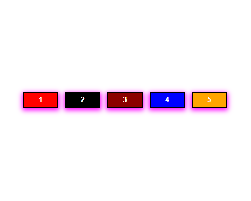
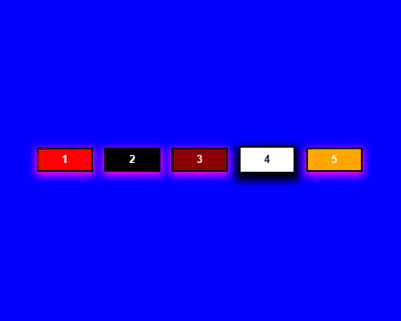

# Botões Refletores

## Sobre o projeto.
Botões coloridos que passam suas cores por clique. Iluminando a página com a cor escolhida de cada botão.<br><br>
Data de conclusão: 25/11/2021<br><br>
## Ferramentas e tecnologias usadas nesse projeto.
 
```js    
function ReflectorButtons(Project) {
    const FrontEnd = `${HTML}, ${CSS}, ${JavaScript}`;
};

``` 
<br>

<div align="center">




</div>

---

> - Autores: 
>   - [Eduardo Kayke](https://github.com/EduardoKayke "Perfil do Eduardo")

- [Voltar ao perfil do Github.](https://github.com/EduardoKayke "Perfil do Eduardo")

_Um dia seremos a tecnologia. Biohacking a própria evolução de nós mesmos._
